# User Guide

## Create a Freezer

From the app drawer, select the "Freezers" item to open the list of freezers (shown below). 

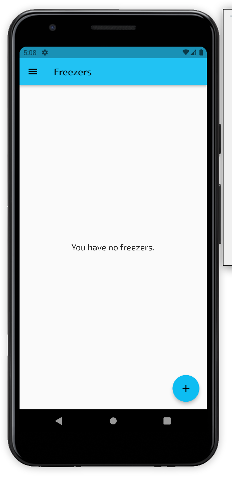

Tap the add button (plus button in the lower right corner of the screen) to open the freezer editor.

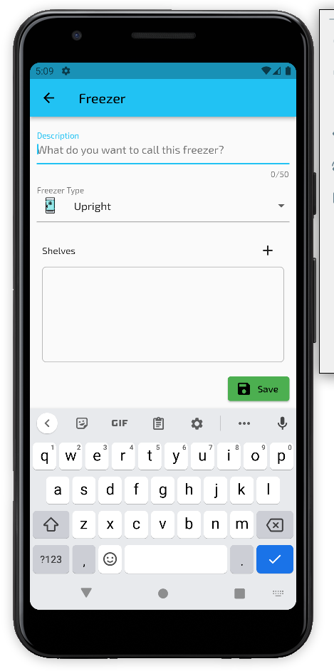

> Do the fields like I id below for items

This screen allows you to give the freezer a name, a freezer type (Upright, Chest, or Drawer), along with an optional
list of shelves available in the freezer. The shelves are used to help populated the "location" information field found
in the freezer item entries. They may be re-ordered by long-pressing on them and dragging them up or down in the list. A
shelf may be removed by tapping the X on the right size of the entry.

When you are done creating your freezer, tap the Save button. You will be returned to the freezer list screen, with your
freezer now on the list (shown below).

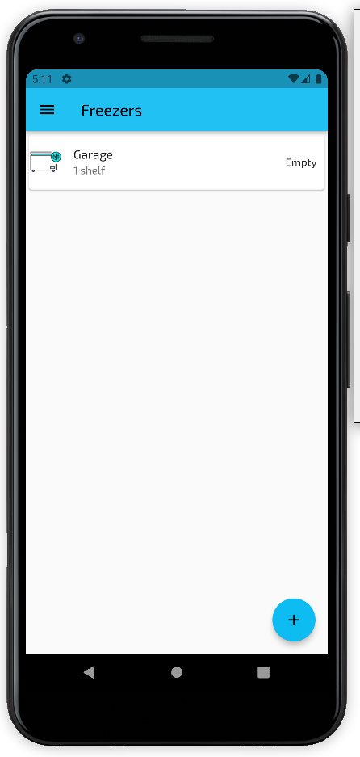

## Edit a Freezer

In the app drawer, open the "Freezers" screen to show the list of freezers. 

Tap the desired freezer to open it in the editor screen.

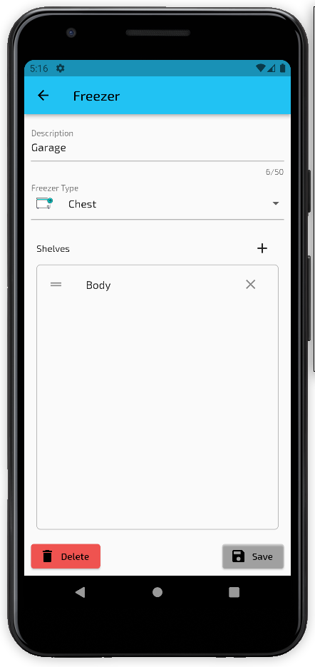

You can change the description text and the type of freezer. You can also add, remove or reorder the shelves associated
with the freezer. When you are done, tap the "Save" button to save your changes.

The freezer can be deleted by tapping the "Delete" button.

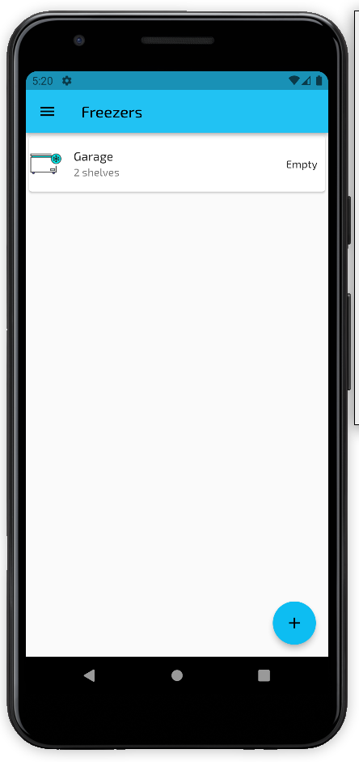

Notice that a second "shelf" was added to the "Garage" freezer in the list.

## Delete a Freezer

From the app drawer, select "Freezers" to open the freezer list. To delete a freezer from the list, slide the desired
freezer to the left:

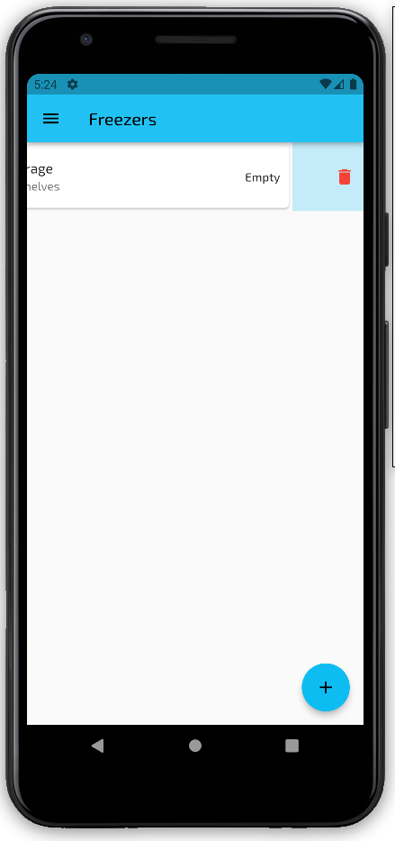

A confirmation message will be displayed. If you select "Yes", the freezer will be deleted from your list of freezers.

> Note: You cannot delete a freezer if it has items associated with it. You will need to remove the items or move them 
> to another freezer before removing the freezer itself.

## Create a Freezer Item

In the app drawer, select the "Freezer Items" option to display the list of items in your freezers:

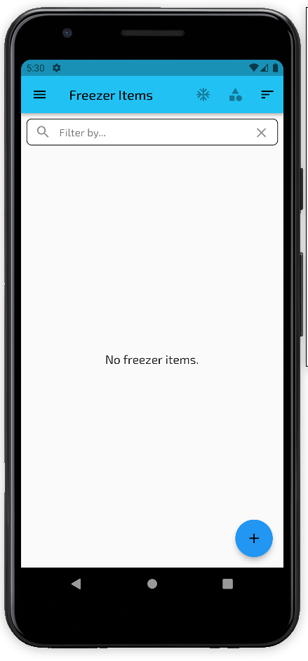

To add an item, tap the floating plus button on the bottom right of the screen. The freezer item adding screen will be 
opened:

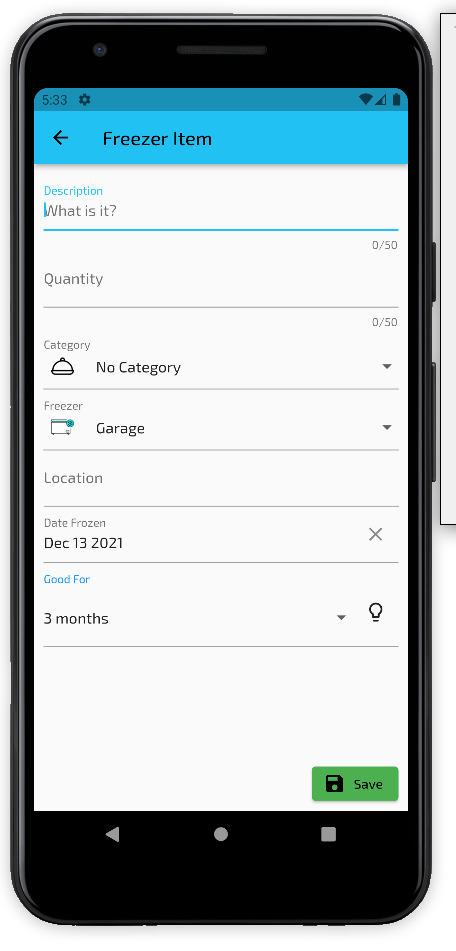

On this screen, you can describe the item being frozen with the following fields:

**Description.** The description of the item being frozen - should be short and descriptive.

**Quantity.** The amount of the item being frozen - a count, weight, etc.

**Category.** A general categorization of the item.

**Freezer.** The freezer where this item is stored (one of the freezers from your list).

**Location.** The location of the item in the freezer. The "shelves" you configured in your freezer will be suggested,
but any value may be entered.

**Date Frozen.** The date when you put the item in the freezer. It will automatically be set to today.

**Good For.** How long the item is good for in the freezer, before it needs to be consumed or disposed of.

> The light bulb icon next to the "Good For" selector will display a list of suggested values based on the type of food
being stored, as shown below:
> 
> 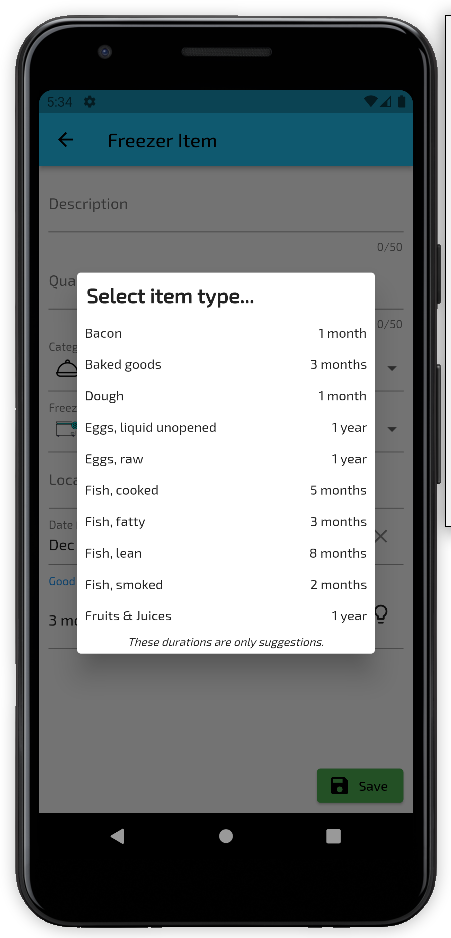

When you are done filling in the information for the freezer item, tap the "Save" button to add it to your freezer and 
return to the list of items, where your item will now be in the list:

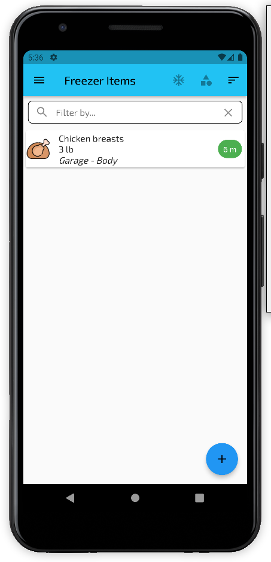

## Edit a Freezer Item

To edit a freezer item, select "Freezer Items" from the app drawer to open the list of items:

Tap on the item you want to edit to open the freezer item editor view:

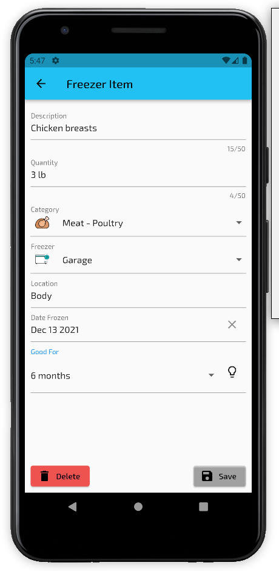

On this screen, you can change the information for the item:

**Description.** The description of the item being frozen - should be short and descriptive.

**Quantity.** The amount of the item being frozen - a count, weight, etc.

**Category.** A general categorization of the item.

**Freezer.** The freezer where this item is stored (one of the freezers from your list).

**Location.** The location of the item in the freezer. The "shelves" you configured in your freezer will be suggested,
but any value may be entered.

**Date Frozen.** The date when you put the item in the freezer. It will automatically be set to today.

**Good For.** How long the item is good for in the freezer, before it needs to be consumed or disposed of.

> The light bulb icon next to the "Good For" selector will display a list of suggested values based on the type of food
being stored, as shown below:
>
> 

When you are done editing the item, tap the "Save" button to save your changes and return to the list of items.

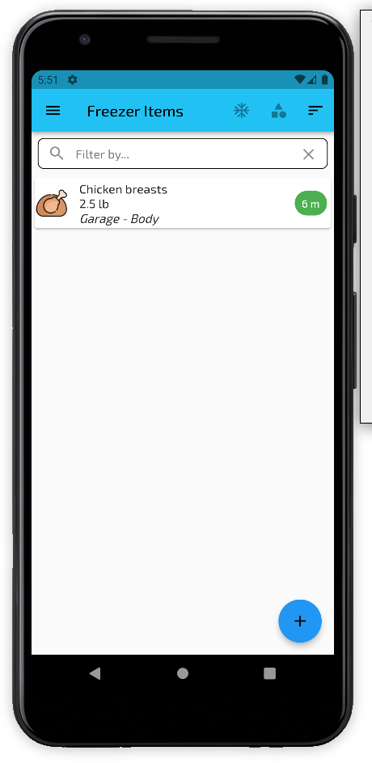

Notice that we changed the "quantity" from "3 lb" to "2.5 lb".

You can also delete the item while on the editing screen, by tapping the "Delete" button.

## Change the Quantity of a Freezer Item

From the "Freezer Items" list, you can quickly change the quantity of an item by long-pressing on the desired item. This
will open a dialog where you can enter the new quantity value:

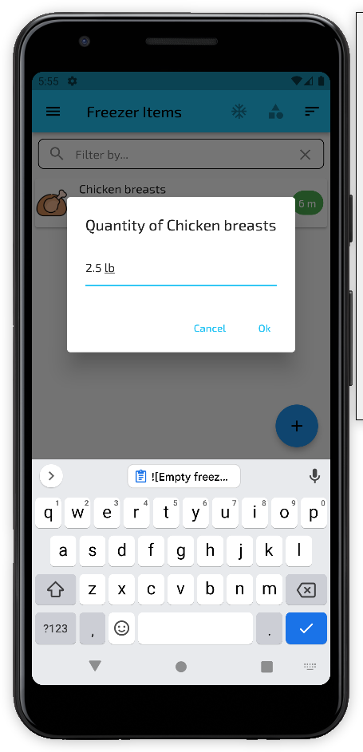

Enter your new value and tap the "Ok" button to save it, or "Cancel" to leave it as it was and return to the list.

## Delete a Freezer Item

From the app drawer, select "Freezer Items" to open the freezer item list. To delete an item from the list, slide the 
desired item to the left:

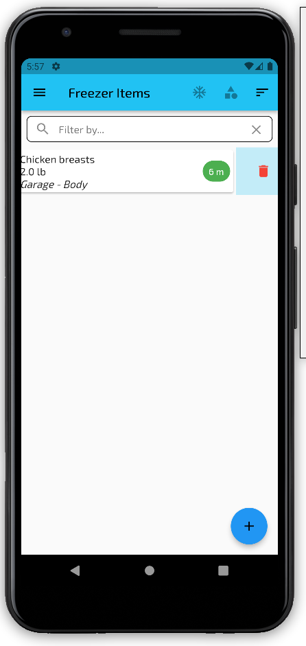

A confirmation message will be displayed. If you select "Yes", the item will be deleted from your list of items.

## Filtering Items By Freezer

When viewing the freezer items list, you can filter the displayed items so that only those in a specific freezer are 
shown. Starting with a list of items:

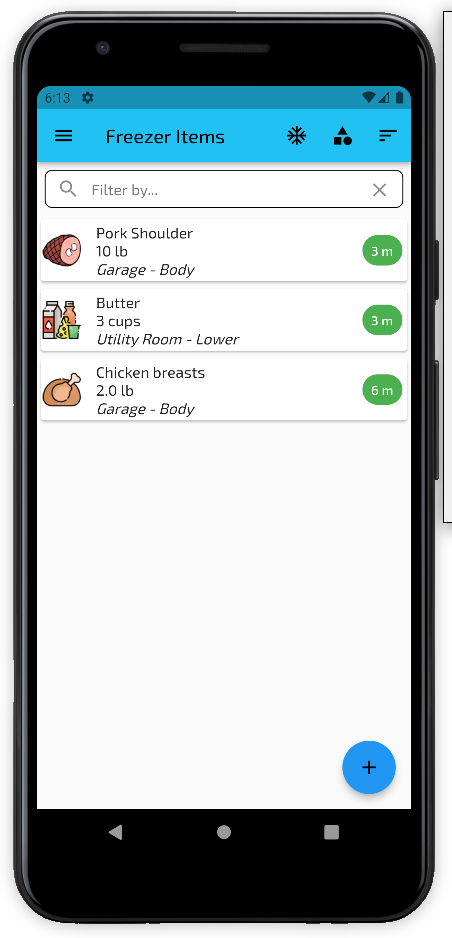

Tap the freezer filter icon (snowflake) in the app header. It will open a list of your freezers - select one to limit 
the view to only items in that freezer (below we've selected the "Utility Room" freezer):

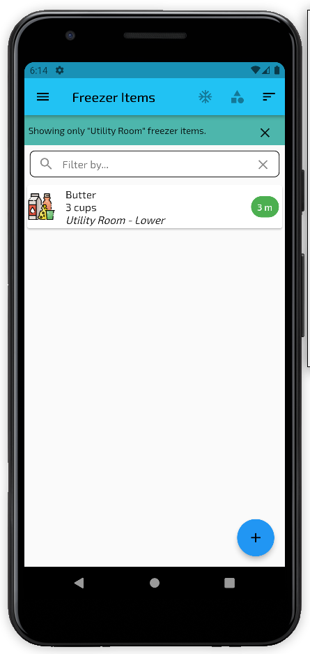

Tap the "X" in the filter banner to clear the filter and display the full list again. You can also use the category 
filter and searching while this is active.

## Filtering Items By Category

When viewing the freezer items list, you can filter the displayed items so that only those in a specific item category
are shown. Starting with a list of items:

Tap the category filter icon (stacked shapes) in the app header. It will open a list of the available categories - 
select one to limit the view to only items of that category (below we've selected the "Meat - Pork" freezer):

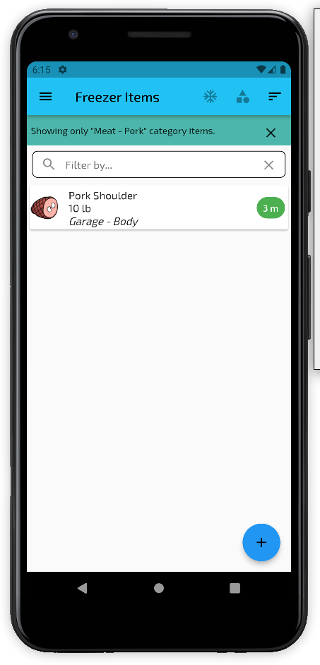

Tap the "X" in the filter banner to clear the filter and display the full list again. You can also use the freezer
filter and searching while this is active.

## Sorting Items

By default, the items in the list view are sorted by the time remaining before they should be removed.

You can change the sorting (and direction) by tapping the sorting icon (three bars) in the app header. It will open a 
dialog allowing you to select what to sort by (and the direction). Below we have sorted by "Description":

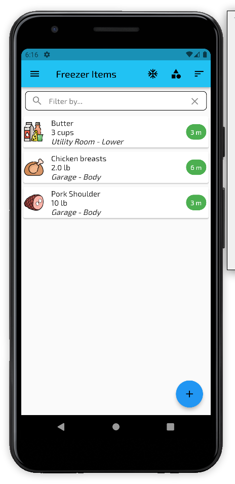

## Searching Items

You can quickly filter the items in the list using the search filter bar. 

When you start typing in the search filter, the list will be filtered to include items that have the text value in their
description, quantity or shelf values. Below we have searched for "pork":

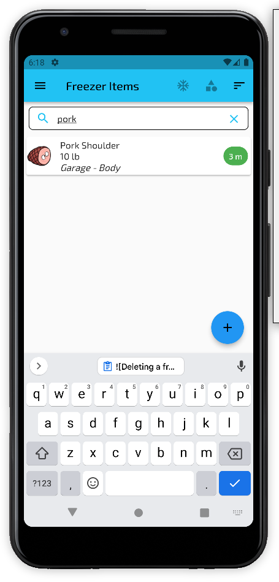

You can clear the search by tapping the "X" on the right side of the search bar.

## Exporting Data

From the drawer, select the "Export / Import" entry and tap the "Export" tab. From here you can select a folder on the 
device where you want to store your exported data. All the data, freezers and freezer items, will be exported to a
well-structured text format (a JSON file).

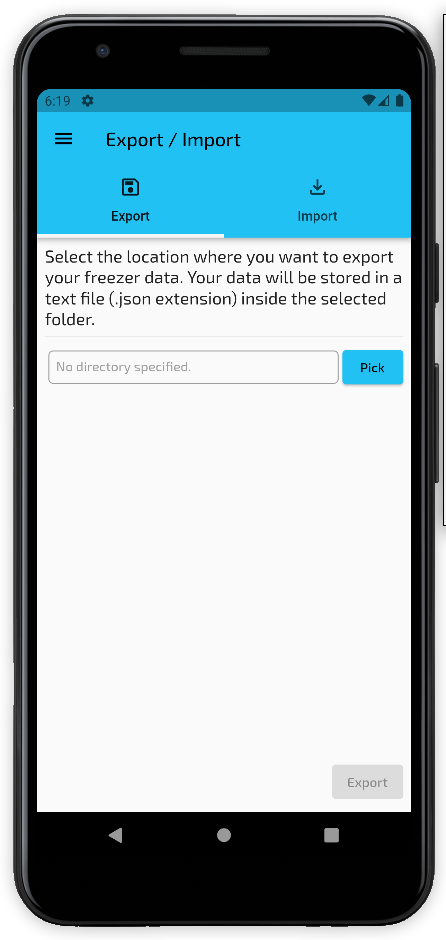

After selecting the folder, the "Export" button will be active. Tap the button to export your data. The file will be in 
the selected folder with a date-stamped name (e.g. icebox-2021-12-13-0845.json).

## Importing Data

From the drawer, select the "Export / Import" entry and tap the "Import" tab. From here you can select a JSON file
on the device containing the exported data you wish to import.

> This may change 

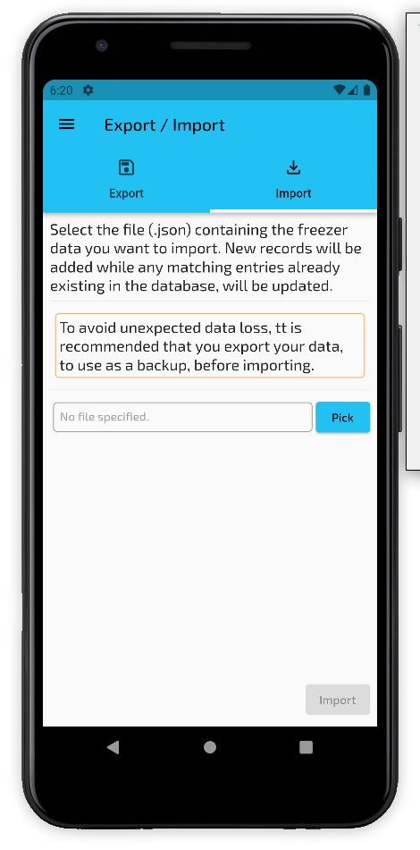

After selecting the file, the "Import" button will be active. Tap the button to import your data.

--- 

Screenshots:

Overview:
* [ ] image of freezer edit screen (general)
* [ ] image of freezer item edit screen (general)
* [ ] image of freezer item list with items of varying age (general)

